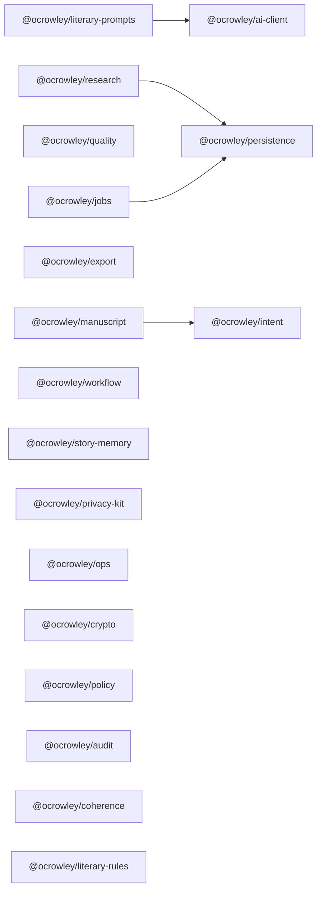
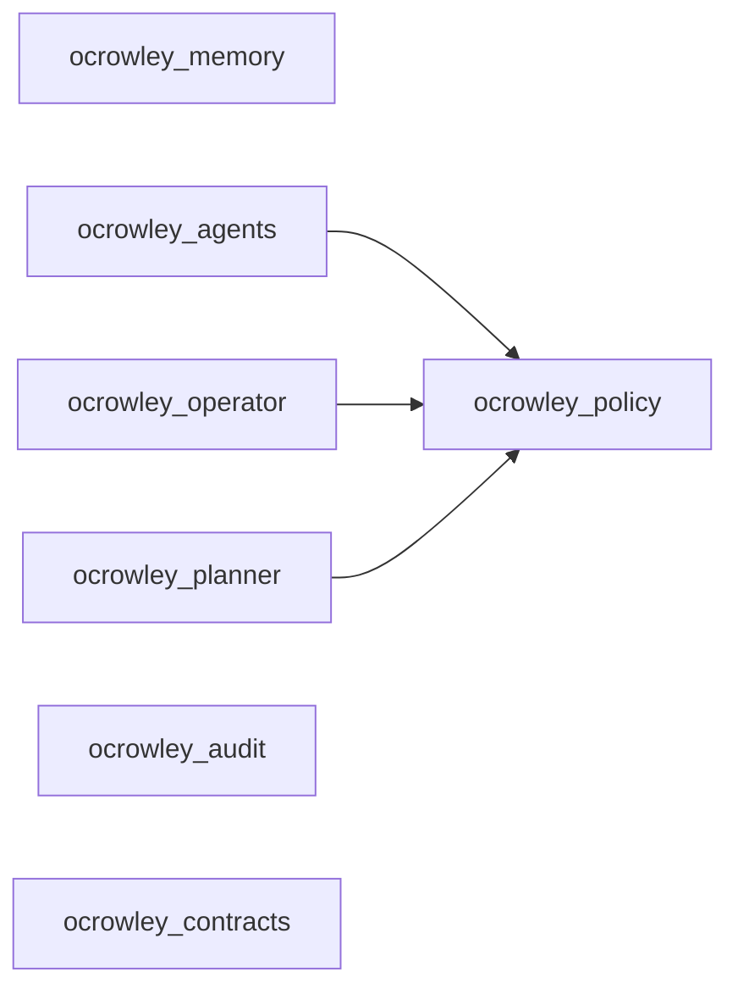

# ocrowley-commons Architecture

## Purpose

`ocrowley-commons` is a polyglot shared library extracted from the public
`ocrowleymatt-stack` repositories. Product apps (Caspa, Shakespeare-, Life-os,
craigs-navigator) remain separate and consume these packages.

## Design principles

1. **Outputs before apply / plan ≠ write** — literary intent routing blocks plan-as-output unless asked.
2. **Ollama-first with cloud failover** — local cheap tasks, paid models for quality.
3. **Safety before autonomy** — risk-tiered HITL gates; Digsbody execute stays off by default.
4. **Evidence-first, non-diagnostic companion** — privacy kit never claims clinical truth.
5. **Local-first / cloud-second persistence** — atomic file writes + cache-first reads.
6. **Honest research** — stub search returns `web_search_unavailable` instead of fabricated results.
7. **Stdlib-first Python cores** — agent OS packages avoid heavy runtime deps.

## Layout

```
ocrowley-commons/
  packages/           # npm workspaces (@ocrowley/*)
  python/             # installable ocrowley_* packages + tests
  docs/               # architecture + extraction map
  .github/workflows/  # CI for TS + Python
```

## TypeScript dependency graph



## Python dependency graph



## Source-of-truth rules

| Concern | Prefer |
|---------|--------|
| AI client / jobs / research desk shape | Caspa `caspa-studio` branch |
| Intent/output contracts | Caspa `caspa-rewire-working` |
| Commission/doctor/promise/psychology | Caspa `main` |
| Local-first persistence API | Shakespeare `fix/local-first-persistence` |
| Agent OS cores | Life-os `main` only |
| Privacy UX contracts | craigs-navigator `main` |
| Never vendor | TheBigBrother fork, handsy intercept stubs, nested AI Studio dumps |

## Consumption model

Apps depend on packages via workspace path, git URL, or published npm/PyPI
versions. Express/React shells, Firebase wiring, and Capacitor projects stay
in the app repos.

## Testing

- TypeScript: Node native test runner via `tsx` per package.
- Python: pytest suites ported from Life-os (`python/tests`).
- CI runs both on push/PR.
